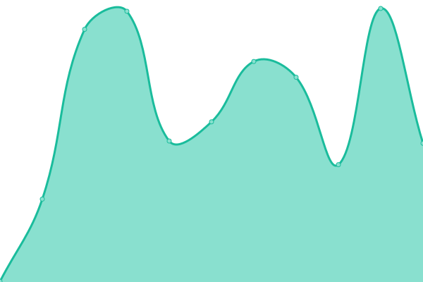

# [📈 Live Status](https://machado-lab.github.io/rabapp-upptime): <!--live status--> **🟩 All systems operational**

This repository contains the open-source uptime monitor and status page for [The Machado Lab at NCSU](https://machado-lab.github.io/), powered by [Upptime](https://github.com/upptime/upptime).

With [Upptime](https://upptime.js.org), you can get your own unlimited and free uptime monitor and status page, powered entirely by a GitHub repository. We use [Issues](https://github.com/machado-lab/rabapp-upptime/issues) as incident reports, [Actions](https://github.com/machado-lab/rabapp-upptime/actions) as uptime monitors, and [Pages](https://machado-lab.github.io/rabapp-upptime) for the status page.

<!--start: status pages-->
<!-- This summary is generated by Upptime (https://github.com/upptime/upptime) -->
<!-- Do not edit this manually, your changes will be overwritten -->
<!-- prettier-ignore -->
| URL | Status | History | Response Time | Uptime |
| --- | ------ | ------- | ------------- | ------ |
|  [RABapp™](https://rabapp.org) | 🟩 Up | [ra-bapp.yml](https://github.com/machado-lab/rabapp-upptime/commits/HEAD/history/ra-bapp.yml) | 

 389ms
     
 | 

<a href="https://status.rabapp.org/history/ra-bapp">100.00%</a>
    

|  [RABapp™ API](https://api.rabapp.org/health/ready) | 🟩 Up | [ra-bapp-api.yml](https://github.com/machado-lab/rabapp-upptime/commits/HEAD/history/ra-bapp-api.yml) | 

 387ms
     
 | 

<a href="https://status.rabapp.org/history/ra-bapp-api">100.00%</a>
    

|  [RABapp™ accounts](https://api.rabapp.org/auth/realms/rabapp/.well-known/openid-configuration) | 🟩 Up | [ra-bapp-accounts.yml](https://github.com/machado-lab/rabapp-upptime/commits/HEAD/history/ra-bapp-accounts.yml) | 

 45ms
     
 | 

<a href="https://status.rabapp.org/history/ra-bapp-accounts">100.00%</a>
    

<!--end: status pages-->

[**Visit our status website →**](https://machado-lab.github.io/rabapp-upptime)

## 📄 License

- Powered by: [Upptime](https://github.com/upptime/upptime)
- Code: [MIT](./LICENSE) © [Anand Chowdhary](https://anandchowdhary.com), supported by [Pabio](https://pabio.com)
- Data in the `./history` directory: [Open Database License](https://opendatacommons.org/licenses/odbl/1-0/)
